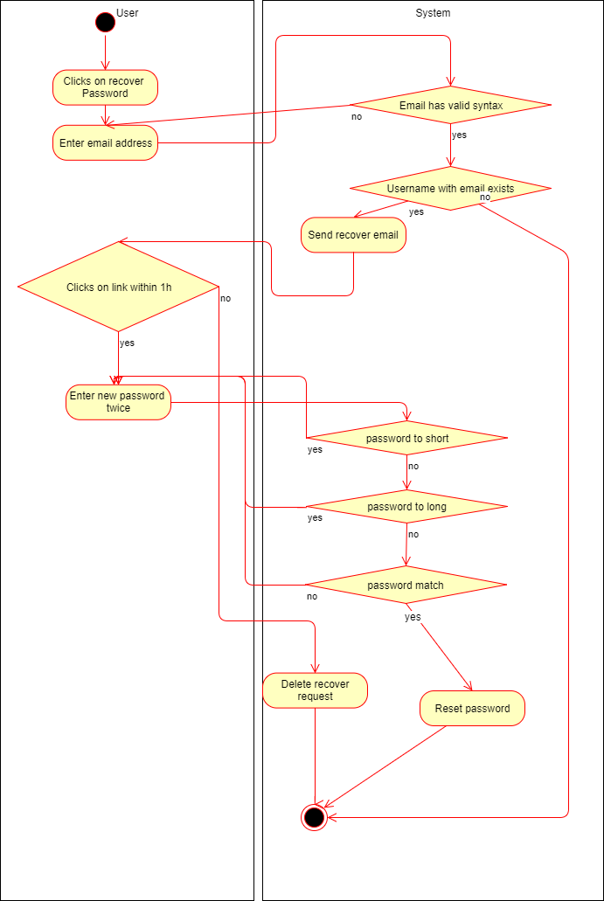
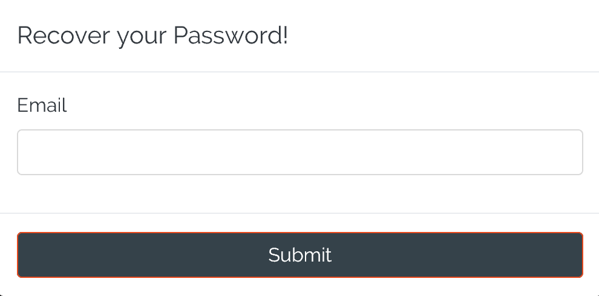
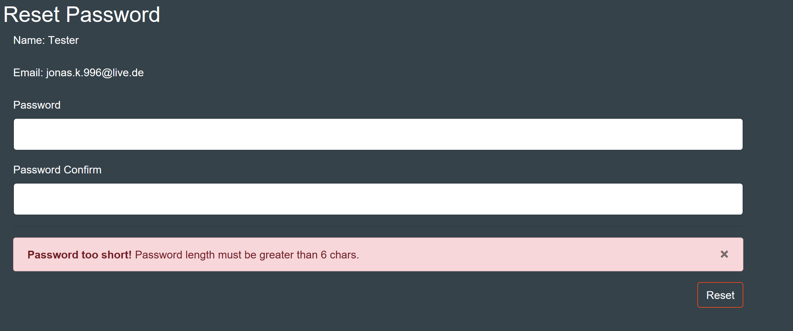
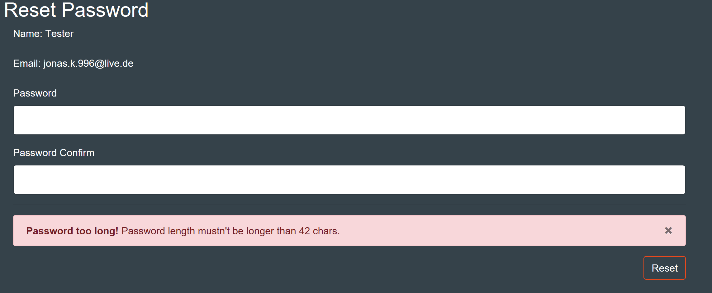

# DigitalJournal
## Use-Case Specification: <NAME>  v. <1.0>

## 1. Use-Case <NAME>

### 1.1 Brief Description

The user does not remember his password and wants to reset it

## 2. Flow of Events

### 2.1 Basic flow

The user entered his email correctly.

He therefore receives an email with a link to recover his password.

If he clicks on the link an entered a new password twice, the password is 6 to 42 characters long and the password matches then his password will be reset

### 2.2 The provided email is invalid

The user entered an email address that has no valid syntax.

### 2.3 The user does not click on the link in time

The uses entered his email correctly and receives an email with a link to recover his password.

 
However if he does not do it within 1h. The request will be deleted an the link is no longer valid.

### 2.4 The user typed his email wrong/the email has no account 

The same message will be display in order to avoid bruteforcing of mails.

### 2.5 The user clicked on the link but the password is not at least 6 characters long

The uses entered his email correctly and receives an email with a link to recover his password.

The user entered a password that is not at least 6 characters long.

### 2.6 The user clicked on the link but the password is longer than 42 characters long

The uses entered his email correctly and receives an email with a link to recover his password.

The user entered a password that is longer than 42 characters long.

### 2.7 The user clicked on the link but the passwords do not match

The uses entered his email correctly and receives an email with a link to recover his password.

The user entered a passwords that do not match.

## 3. Special Requirements

**n / a**

## 4. Preconditions

**n / a**

## 5. Postconditions

### 5.1 The password is changed

After successfully changing your password, you can now log in with the new password.

## 6. Extension Points

**n / a**